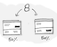

# DIU21
Prácticas Diseño Interfaces de Usuario 2020-21 (Tema: Turismo)

Grupo: DIU1_01AABB.  Curso: 2020/21
Updated: 8/2/2021

Proyecto:
>>> Decida el nombre corto de su propuesta en la práctica 2

Descripción:

>>> Describa la idea de su producto en la práctica 2

Logotipo:
>>> Opcionalmente si diseña un logotipo para su producto en la práctica 3 pongalo aqui

Miembros
 * :bust_in_silhouette:   Javier Vélez Jiménez     :octocat:     
 * :bust_in_silhouette:  Jorge García Moreno     :octocat:

-----

# Proceso de Diseño

## Paso 1. UX Desk Research & Analisis

 1.a Competitive Analysis
-----

>>> Describe brevemente características de las aplicaciones que tienes asignadas, y por qué has elegido una de ellas (150-300 caracteres)
https://www.esmadrid.com/
 1.b Persona
-----

>>> En primer lugar hemos creado a Sebastián Es una persona de mediana edad que utiliza habitualmente las redes sociales y se ha interesado
en la web debido a su trabajo y aficiones.

>>> La segunda persona que hemos elegido es Lourdes
>>> 
Se trata de estudiante/trabajadora con una buena capacidad para moverse por Internet pero con no demasiada experiencia a la hora de realizar actividades al aire libre, se trata de una persona introvertida, por lo que aunque disfruta de realizar actividades al aire libre, posee cierta reticencia a la hora de llevar a cabo actividades grupales.

 1.c User Journey Map
----

>>> En la primera experiencia de usuario vemos como Sebastián encuentra el sitio web, busca y reserva el tour que le interesa y finalmente tras acabar satisfecho con el tour,
vuelve a la página para disfrutar de nuevo sus servicios.

>>> En la segunda experiencia de usuario tenemos a Lourdes con la intención de realizar una excursión por Granada, ciudad a la que acaba de llegar, pero necesita encontrar un lugar en donde se asegure que la información proporcionada es segura y navegando entre páginas encuentra la de TourGranada y escoge una ruta por la montaña en bicicleta. Se trata de una práctica un poco específica pero algo habitual.

>>>

>>>

 1.d Usability Review
----
>>>  Revisión de usabilidad: (toma los siguientes documentos de referncia y verifica puntos de verificación de  usabilidad
>>>> SE deben incluir claramente los siguientes elementos
>>> - Enlace al documento:  (sube a github el xls/pdf)
>>> - Valoración final (numérica):
>>> - Comentario sobre la valoración:  (60-120 caracteres)

## Paso 2. UX Design  

 2.a Feedback Capture Grid / EMpathy map / POV
----

>>> Comenta con un diagrama los aspectos más destacados a modo de conclusion de la práctica anterior,

 Interesante | Críticas     
| ------------- | -------
  Preguntas | Nuevas ideas

>>> ¿Que planteas como "propuesta de valor" para un nuevo diseño de aplicación para economia colaborativa ?
>>> Problema e hipótesis
>>>  Que planteas como "propuesta de valor" para un nuevo diseño de aplicación para economia colaborativa te
>>> (150-200 caracteres)

 2.b ScopeCanvas
----
>>> Propuesta de valor

 2.b Tasks analysis
-----

>>> Definir "User Map" y "Task Flow" ...

 2.c IA: Sitemap + Labelling
----

>>> Identificar términos para diálogo con usuario  

Término | Significado     
| ------------- | -------
  Login¿?  | acceder a plataforma

 2.d Wireframes
-----

>>> Plantear el  diseño del layout para Web/movil (organización y simulación )

## Paso 3. Mi UX-Case Study (diseño)

 3.a Moodboard
-----

>>> Plantear Diseño visual con una guía de estilos visual (moodboard)
>>> Incluir Logotipo
>>> Si diseña un logotipo, explique la herramienta utilizada y la resolución empleada. ¿Puede usar esta imagen como cabecera de Twitter, por ejemplo, o necesita otra?

  3.b Landing Page
----

>>> Plantear Landing Page

 3.c Guidelines
----

>>> Estudio de Guidelines y Patrones IU a usar
>>> Tras documentarse, muestre las deciones tomadas sobre Patrones IU a usar para la fase siguiente de prototipado.

  3.d Mockup
----

>>> Layout: Mockup / prototipo HTML  (que permita simular tareas con estilo de IU seleccionado)

 3.e ¿My UX-Case Study?
-----

>>> Publicar my Case Study en Github..
>>> Documente y resuma el diseño de su producto en forma de video de 90 segundos aprox

## Paso 4. Evaluación

 4.a Caso asignado
----

>>> Breve descripción del caso asignado con enlace a  su repositorio Github

 4.b User Testing
----

>>> Seleccione 4 personas ficticias. Exprese las ideas de posibles situaciones conflictivas de esa persona en las propuestas evaluadas. Asigne dos a Caso A y 2 al caso B

| Usuarios | Sexo/Edad     | Ocupación   |  Exp.TIC    | Personalidad | Plataforma | TestA/B
| ------------- | -------- | ----------- | ----------- | -----------  | ---------- | ----
| User1's name  | H / 18   | Estudiante  | Media       | Introvertido | Web.       | A
| User2's name  | H / 18   | Estudiante  | Media       | Timido       | Web        | A
| User3's name  | M / 35   | Abogado     | Baja        | Emocional    | móvil      | B
| User4's name  | H / 18   | Estudiante  | Media       | Racional     | Web        | B

. 4.c Cuestionario SUS
----

>>> Usaremos el **Cuestionario SUS** para valorar la satisfacción de cada usuario con el diseño (A/B) realizado. Para ello usamos la [hoja de cálculo](https://github.com/mgea/DIU19/blob/master/Cuestionario%20SUS%20DIU.xlsx) para calcular resultados sigiendo las pautas para usar la escala SUS e interpretar los resultados
http://usabilitygeek.com/how-to-use-the-system-usability-scale-sus-to-evaluate-the-usability-of-your-website/)
Para más información, consultar aquí sobre la [metodología SUS](https://cui.unige.ch/isi/icle-wiki/_media/ipm:test-suschapt.pdf)

>>> Adjuntar captura de imagen con los resultados + Valoración personal

 4.d Usability Report
----

>> Añadir report de usabilidad para práctica B (la de los compañeros)

>>> Valoración personal

## Paso 5. Evaluación de Accesibilidad  

  5.a Accesibility evaluation Report
----

>>> Indica qué pretendes evaluar (de accesibilidad) sobre qué APP y qué resultados has obtenido

>>> 5.a) Evaluación de la Accesibilidad (con simuladores o verificación de WACG)
>>> 5.b) Uso de simuladores de accesibilidad

>>> (uso de tabla de datos, indicar herramientas usadas)

>>> 5.c Breve resumen del estudio de accesibilidad (de práctica 1) y puntos fuertes y de mejora de los criterios de accesibilidad de tu diseño propuesto en Práctica 4.

## Conclusión final / Valoración de las prácticas

>>> (90-150 palabras) Opinión del proceso de desarrollo de diseño siguiendo metodología UX y valoración (positiva /negativa) de los resultados obtenidos  

# Prueba
